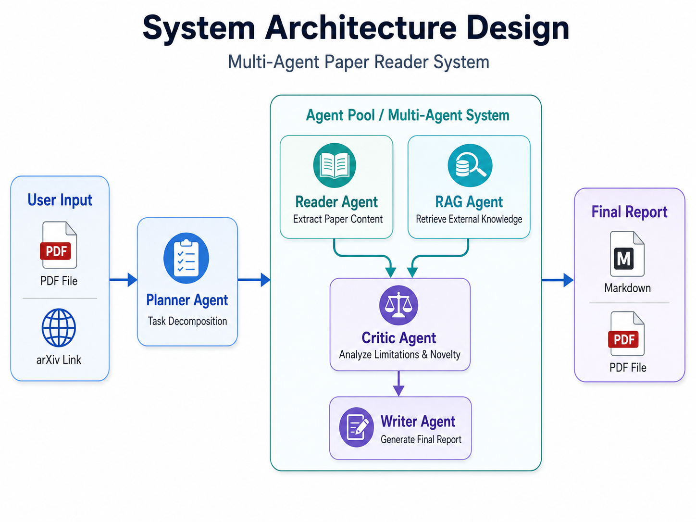
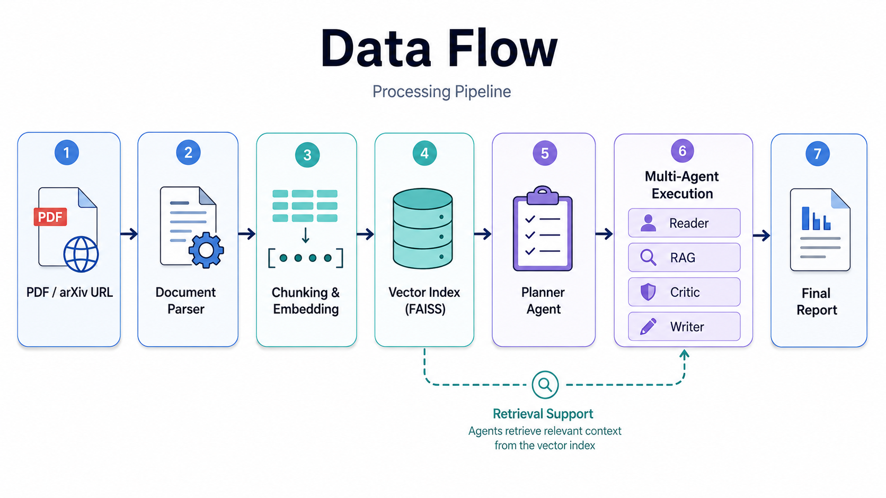

# Multi-Agent Paper Reader System — Design Doc (v0.1)

- **Project Name:** Multi-Agent Paper Reader System
- **Version:** v0.1
- **Document Type:** Development Design Document
- **Author:** ChatGPT
- **Status:** Draft / Initial Design

---

## 1. Project Goal (Problem Statement)

### 1.1 Background
科研论文阅读通常包含多个高成本步骤：获取论文、提取核心内容、理解方法细节、梳理实验结果、判断创新性与局限性，并最终整理成可复用的阅读报告。传统的单轮问答式 AI 往往只能完成“摘要”这一部分，难以形成完整、可复盘、可扩展的科研阅读工作流。

### 1.2 Core Goal
本项目旨在构建一个 **多智能体论文阅读系统（Multi-Agent Paper Reader System）**，利用多个分工明确的 Agent 协作完成以下任务：

- 结构化阅读论文
- 提取关键贡献与创新点
- 解析方法与实验设计
- 总结实验结果与结论
- 识别局限性与潜在问题
- 生成标准化论文阅读报告

最终输出应是一份适合科研复盘、文献调研和项目预研使用的 **Markdown / PDF 报告**。

### 1.3 Non-Goals
为控制项目复杂度，v0.1 不包含以下内容：

- 不负责自动撰写完整论文
- 不负责训练新的机器学习模型
- 不实现复杂的前端产品化设计
- 不实现长期跨会话记忆系统
- 不支持大规模多用户协同

---

## 2. User Scenarios (Use Cases)

### UC1. Single Paper Analysis
**Input:** PDF 文件或 arXiv 链接  
**Output:**
- TL;DR
- 论文核心贡献
- 方法结构总结
- 实验结果摘要
- 局限性分析
- 最终阅读报告

### UC2. Paper Comparison (Planned for v2)
**Input:** 两篇论文  
**Output:**
- 方法对比表
- 创新点差异分析
- 实验设置对比
- 综合评价

### UC3. Ask-the-Paper Q&A（单论文版本已实现）
**Input:** 用户围绕单篇论文提问  
**Output:** 基于论文内容和检索上下文的引用式回答

当前实现已支持持久化多轮会话、当前论文内会话搜索、事务级单会话删除、Markdown/JSON 引用归档、预算化最近上下文追问改写、BM25/向量混合检索与 RRF、章节与页码交集筛选、中英文回答、Evidence 回溯、引用白名单、可恢复流式事件、取消和失败重试。历史消息数、历史 token 与 Evidence token 分别受可配置预算约束，Mock Embedding、模型改写失败或 Embedding 服务异常均可安全降级。多论文对话和更大规模的问答忠实度评估仍属于后续范围。

---

## 3. System Architecture Design

系统采用 **Planner + Specialized Agents** 的多智能体结构。Planner Agent 负责对用户任务进行拆解；Agent Pool 中的不同 Agent 分别承担内容提取、检索增强、批判分析和报告撰写等职责，最终由 Writer Agent 汇总生成最终报告。

```
                ┌──────────────┐
                │  User Input   │
                └──────┬───────┘
                       ↓
            ┌─────────────────────┐
            │ Planner Agent       │
            │ (任务拆解)          │
            └──────┬──────────────┘
                   ↓
     ┌────────────────────────────────┐
     │         Agent Pool             │
     │                                │
     │  Reader Agent   → 提取内容     │
     │  RAG Agent      → 外部知识     │
     │  Critic Agent   → 批判分析     │
     │  Writer Agent   → 生成报告     │
     └───────────────┬────────────────┘
                     ↓
            ┌─────────────────┐
            │ Final Report     │
            └─────────────────┘
```



### 3.1 High-Level Design Notes
- **User Input** 负责接收 PDF 文件或 arXiv 链接。
- **Planner Agent** 根据用户请求决定执行模式与任务拆解。
- **Reader Agent** 负责提取论文结构与核心内容。
- **RAG Agent** 负责检索相关上下文与外部知识。
- **Critic Agent** 负责分析论文局限性、实验充分性和创新性。
- **Writer Agent** 将多个 Agent 的结果整合为标准化输出。
- **Final Report** 支持 Markdown 与 PDF 两类结果交付形式。

---

## 4. Agent Design

### 4.1 Planner Agent
**Responsibility:**
- 解析用户请求
- 判断当前任务属于单篇分析、对比分析还是问答模式
- 生成任务清单与执行顺序
- 决定是否需要外部检索或引用增强

**Typical Output Example:**
```json
{
  "mode": "single_paper_analysis",
  "tasks": [
    "parse_document",
    "extract_method",
    "summarize_experiments",
    "analyze_limitations",
    "write_report"
  ]
}
```

### 4.2 Reader Agent
**Responsibility:**
- 阅读解析后的论文文本
- 提取论文的结构化信息
- 总结引言、方法、实验、结论等模块

**Expected Outputs:**
- Title / Abstract summary
- Main contributions
- Method summary
- Experimental setup and results
- Key claims

### 4.3 RAG Agent
**Responsibility:**
- 从向量索引中检索相关内容
- 为其它 Agent 提供补充上下文
- 在未来版本中可扩展到外部论文库、arXiv API、Semantic Scholar 等

**Expected Outputs:**
- Relevant chunks
- Contextual evidence
- Related work snippets

### 4.4 Critic Agent
**Responsibility:**
- 识别论文中可能存在的问题或不足
- 判断实验是否充分
- 分析创新点是否清晰、是否与已有工作重复
- 提供科研视角下的批判性总结

**Expected Outputs:**
- Limitations
- Possible weaknesses
- Missing baselines or ablations
- Credibility assessment

### 4.5 Writer Agent
**Responsibility:**
- 汇总来自 Reader / RAG / Critic 的结果
- 生成结构清晰的最终报告
- 输出统一模板，便于复用和存档

**Expected Outputs:**
- Markdown report
- Optional PDF export
- Structured sections and citations

---

## 5. Technical Stack

### 5.1 Agent Layer
- **AutoGen**：作为多智能体编排框架，负责 Agent 间消息传递与工作流调度。

### 5.2 RAG Layer
- **LlamaIndex**：负责文档切分、索引构建与检索抽象。
- **FAISS**：作为本地向量索引，支持快速语义检索。

### 5.3 Document Processing Layer
- **PyMuPDF**：用于 PDF 文本抽取与基础结构处理。

### 5.4 API Layer
- **FastAPI**：用于构建后端接口，如上传论文、触发分析、获取结果等。

### 5.5 UI Layer
- **Streamlit**：用于快速构建 demo 界面，便于展示项目能力。

### 5.6 LLM Layer
- **GPT-4.1 / GPT-5 mini（API）**：用于 Agent 推理与报告生成。
- 未来可扩展本地模型，如 Qwen2.5、Llama 系列。

---

## 6. Data Flow

系统数据流从输入文档开始，经过文档解析、切分与向量化，再由 Planner Agent 触发多智能体执行。向量索引为后续 Agent 提供检索支持，最终输出结构化阅读报告。

```
PDF / URL
   ↓
Document Parser
   ↓
Chunking + Embedding
   ↓
RAG Index (FAISS)
   ↓
Planner Agent
   ↓
Multi-Agent Execution
   ↓
Writer Agent
   ↓
Final Report
```



### 6.1 Data Flow Steps
1. **PDF / arXiv URL**：接收用户输入。
2. **Document Parser**：解析 PDF 或网页内容。
3. **Chunking & Embedding**：切分文本并生成向量表示。
4. **Vector Index (FAISS)**：存储可检索的语义索引。
5. **Planner Agent**：根据任务目标规划执行流程。
6. **Multi-Agent Execution**：Reader、RAG、Critic、Writer 协同执行。
7. **Final Report**：输出最终 Markdown / PDF 报告。

---

## 7. MVP Definition

### 7.1 Scope of v0.1 MVP
MVP 版本应聚焦于“单篇论文分析”这一核心场景，仅实现最关键的能力闭环：

- 输入单篇 PDF 或 arXiv 链接
- 完成文档解析与切分
- 建立本地向量索引
- 使用 3–4 个核心 Agent 执行分析
- 生成标准化 Markdown 报告

### 7.2 What MVP Must Include
- 基本的文件上传 / 链接输入能力
- Planner Agent
- Reader Agent
- Critic Agent
- Writer Agent
- 基础 RAG 检索支持
- Markdown 输出

### 7.3 What MVP Intentionally Excludes
- 多论文对比
- 复杂权限系统
- 多用户支持
- 云端部署优化

> 状态更新（2026-07-13）：单篇论文的对话式持续问答、会话管理、页码范围及预算化上下文窗口已完成；下一产品阶段为扩大忠实度评估并解决 pilot validation 失败，其余条目仍未实现。

---

## 8. Future Extensions (v2+)

### v2 Candidate Features
- Paper Comparison Mode
- Ask-the-Paper Q&A 深化：扩大忠实度评估集与多论文扩展
- Citation-aware report generation
- Figure understanding and caption explanation
- Related-work retrieval from external APIs

### Domain-Specific Extension
未来可进一步扩展为 **BioPaper Agent**，面向生物医学 / 生存分析 / 多模态医学论文，自动生成：
- baseline 对比表
- 创新点分析
- 消融实验建议
- 研究复现注意事项

---

## 9. Technology Selection Rationale

| Component | Selected Tool | Reason |
|---|---|---|
| Agent Framework | AutoGen | 原生支持 multi-agent 协作与消息编排 |
| Retrieval Framework | LlamaIndex | 与文档处理和索引流程集成较成熟 |
| Vector Store | FAISS | 本地部署简单、性能稳定、适合 MVP |
| PDF Parsing | PyMuPDF | 易用、高效、适合论文文本抽取 |
| API Framework | FastAPI | 工程标准、易于扩展为服务 |
| UI | Streamlit | 快速构建演示界面 |
| LLM | GPT API | 推理质量高，适合 Agent 协作任务 |

---

## 10. Risks and Limitations

### 10.1 Technical Risks
- **LLM Hallucination:** 可能生成不准确的论文理解或分析。
- **PDF Parsing Noise:** 不同论文版式可能影响抽取质量。
- **Retrieval Recall Issues:** 检索不充分可能造成上下文缺失。
- **Cost Control:** 多 Agent 协作会增加 token 消耗与延迟。

### 10.2 Design Limitations
- v0.1 更偏向文档理解与总结，不追求完全自动化科研判断。
- 系统输出质量依赖于底层 LLM 与解析质量。
- 多智能体带来的可解释性增强，同时也增加系统复杂度。

---

## 11. Suggested Repository Structure

```text
paper-agent/
├── app/
│   ├── main.py
│   └── api.py
├── agents/
│   ├── planner.py
│   ├── reader.py
│   ├── rag.py
│   ├── critic.py
│   └── writer.py
├── tools/
│   ├── pdf_loader.py
│   ├── chunker.py
│   ├── embedder.py
│   ├── vector_store.py
│   └── arxiv_fetcher.py
├── prompts/
│   ├── planner_prompt.md
│   ├── reader_prompt.md
│   ├── critic_prompt.md
│   └── writer_prompt.md
├── outputs/
├── data/
├── requirements.txt
└── README.md
```

---

## 12. Milestones

### Phase 1: Design & Setup
- 完成需求定义与设计文档
- 搭建项目环境与基础目录结构
- 确认技术栈与开发规范

### Phase 2: MVP Implementation
- 完成 PDF 解析与索引构建
- 实现 Planner / Reader / Critic / Writer
- 接通报告生成链路

### Phase 3: Demo & Optimization
- 接入 Streamlit 页面
- 优化 Prompt 与输出格式
- 增加日志、错误处理和结果缓存

### Phase 4: Extended Features
- 多论文对比
- 问答模式深化与质量评估（单论文基础问答已完成）
- 外部检索增强

---

## 13. Conclusion

本设计文档定义了 Multi-Agent Paper Reader System 的 v0.1 方案。该系统聚焦于“用多智能体协作完成科研论文阅读与总结”这一核心目标，通过 Planner + Reader + RAG + Critic + Writer 的结构，建立一个可扩展、适合 MVP 开发、支持持续演进的 Agent 项目基础。

后续阶段可基于本设计文档继续细化：
- Agent 接口规范
- Prompt 设计
- 消息流转协议
- MVP 开发计划
- API 与前端实现方案
