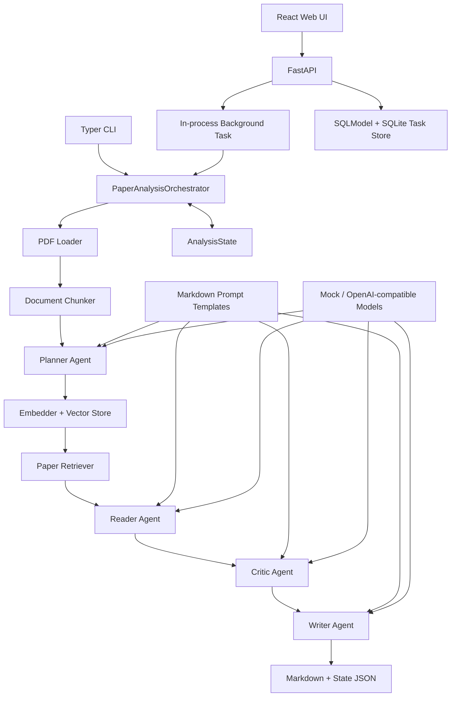

# 📚 Multi-Agent Paper Reader System

> 基于多智能体协作与轻量 RAG 的科研论文阅读、批判和报告生成系统

Multi-Agent Paper Reader System 是一个面向科研论文阅读场景的全栈 MVP。用户通过 Web 页面上传 PDF、填写分析要求并选择报告语言后，系统会依次完成文档解析、文本分块、检索增强、多 Agent 分析，并生成结构化 Markdown 阅读报告。

项目采用 **Planner + Specialized Agents** 架构：Planner 制定阅读计划，Reader 提取论文内容，Critic 进行批判性分析，Writer 汇总最终报告。相比直接让单个模型总结全文，本项目更关注职责拆分、证据检索、结构化中间状态和可测试的端到端工作流。

当前版本定位为可运行、可展示、便于继续扩展的最小实现，不是生产级论文管理平台。

---

## ✨ 项目亮点

- 🤖 **多 Agent 协作**：Planner、Reader、Critic、Writer 分别负责规划、忠实提取、批判分析和报告撰写。
- 📄 **论文处理流水线**：基于 PyMuPDF 提取文本和页码，按可配置窗口切分为稳定的论文分块。
- 🔎 **轻量 RAG**：通过 Embedding、内存向量库和相似度检索，为后续 Agent 提供可引用证据。
- 🧩 **结构化输出**：所有 Agent 输入输出均使用 Pydantic Schema，减少自由文本在工作流中的不确定性。
- 🛡️ **输出容错与重试**：支持从 Markdown 代码块、解释文字和带尾随逗号的响应中提取 JSON；Schema 校验失败时会将错误反馈给模型重试。
- 📝 **外置 Prompt**：Prompt 以 Markdown 文件保存在 `backend/prompts/`，可不改 Agent 代码独立迭代。
- ⚡ **同步与后台 API**：FastAPI 同时提供同步分析接口和基于进程内 `BackgroundTasks` 的后台任务接口。
- 🖥️ **完整 Web MVP**：React + TypeScript 前端支持新建分析与持久化任务历史；历史页展示论文信息、工作流时间线和 Markdown 报告。
- 🧪 **离线 Mock 模式**：无需 API Key 或网络即可运行完整工作流和默认测试，适合开发与演示。
- 🔌 **OpenAI-compatible 接口**：可接入 Qwen、DeepSeek、OpenAI 或其他兼容的 LLM/Embedding 服务。

---

## 🏗️ 系统架构

### 技术栈

| 层级 | 技术 | 职责 |
| :--- | :--- | :--- |
| 前端 | React 19、TypeScript、Vite、react-markdown | 上传论文、展示任务状态和阅读报告 |
| API | FastAPI、Uvicorn、SQLModel、SQLite | 文件上传、后台任务、持久化历史、状态与报告查询 |
| 工作流 | Python、Pydantic | 串行编排论文解析、检索与多 Agent 分析 |
| 文档处理 | PyMuPDF | PDF 文本、页码和基础元数据提取 |
| RAG | NumPy / FAISS-compatible dependency、Embedding | 分块向量化、内存索引和相似度检索 |
| 模型接入 | OpenAI Python SDK | Mock 或 OpenAI-compatible LLM/Embedding API |
| CLI | Typer、Rich | 命令行分析和运行状态输出 |
| 测试 | pytest、Ruff | 单元、集成、真实模型 smoke test 与静态检查 |

### 核心架构



### 端到端流程

```text
上传 PDF
  ↓
解析逐页文本与基础元数据
  ↓
生成带页码和稳定 ID 的文本分块
  ↓
Planner 创建分析任务与关注问题
  ↓
Embedding + 向量索引 + 证据检索
  ↓
Reader 提取问题、贡献、方法和实验
  ↓
Critic 分析局限、风险和可复现性
  ↓
Writer 生成中文或英文 Markdown 报告
  ↓
保存报告和完整 AnalysisState JSON
```

工作流当前按顺序串行执行，各阶段状态会记录在 `AnalysisState.step_history`。后台 API 每 3 秒由前端轮询一次；任务元数据同步持久化到 SQLite，任务完成后前端获取并渲染 Markdown 报告。

---

## 🚀 快速开始

### 环境要求

- Python 3.12+
- [uv](https://docs.astral.sh/uv/)
- Node.js 22+
- npm 10+

以下命令均在仓库根目录执行。

### 1. 安装后端依赖

```bash
uv sync
cp backend/.env.example backend/.env
```

默认 `.env.example` 使用完全离线的 Mock LLM 和 Mock Embedding，不需要 API Key。

### 2. 启动后端

```bash
uv run uvicorn backend.api.main:app --reload
```

后端默认运行在 <http://127.0.0.1:8000>：

- 健康检查：<http://127.0.0.1:8000/api/health>
- Swagger UI：<http://127.0.0.1:8000/docs>
- ReDoc：<http://127.0.0.1:8000/redoc>

### 3. 安装并启动前端

打开另一个终端：

```bash
cd frontend
npm install
npm run dev
```

浏览器访问 Vite 输出的本地地址，通常为 <http://127.0.0.1:5173>。

前端默认请求 `http://127.0.0.1:8000`。如后端运行在其他地址，可创建 `frontend/.env.local`：

```env
VITE_API_BASE_URL=http://127.0.0.1:8000
```

修改 Vite 环境变量后需要重新启动前端开发服务器。

### 4. 使用 Web 页面

1. 选择一个文本型 PDF 文件。
2. 填写希望 Agent 重点分析的问题。
3. 选择中文或英文报告。
4. 点击 **Start Analysis**。
5. 等待任务从 `pending`、`running` 进入 `completed`。
6. 在页面中阅读生成的 Markdown 报告。

切换到 **Task History** 可查看历史任务。页面顶部由每页三张卡片的 Archive 和等高的 Analysis Detail 组成，详情包含论文标题、作者、任务参数和时间；下方 Workflow Timeline 与 Report 纵向排列并可独立折叠。移动端会自动改为单栏布局。

示例 PDF 仅应在确认版权、隐私和再分发许可后加入公开仓库。

---

## ⚙️ 模型配置

应用从 `backend/.env` 读取配置。不要提交真实 API Key。

### 离线 Mock 模式

```env
LLM_PROVIDER=mock
LLM_VENDOR=mock
LLM_MODEL=mock-llm

EMBEDDING_PROVIDER=mock
EMBEDDING_VENDOR=mock
EMBEDDING_MODEL=mock-embedding
```

Mock 模式会走完整的解析、分块、检索、Agent 和导出流程，但模拟输出不代表真实论文分析质量。

### Qwen / DashScope

```env
LLM_PROVIDER=openai_compatible
LLM_VENDOR=qwen
LLM_MODEL=qwen-plus
LLM_API_KEY=your_dashscope_api_key
LLM_BASE_URL=https://dashscope.aliyuncs.com/compatible-mode/v1

EMBEDDING_PROVIDER=openai_compatible
EMBEDDING_VENDOR=qwen
EMBEDDING_MODEL=text-embedding-v4
EMBEDDING_API_KEY=your_dashscope_api_key
EMBEDDING_BASE_URL=https://dashscope.aliyuncs.com/compatible-mode/v1
```

LLM 和 Embedding 可以独立配置。例如可以使用真实 LLM 配合 Mock Embedding，以减少外部调用。

### 主要运行参数

| 环境变量 | 默认值 | 说明 |
| :--- | :--- | :--- |
| `DEFAULT_TOP_K` | `5` | 每个检索问题返回的证据数量 |
| `CHUNK_SIZE` | `1200` | 文本分块目标字符数 |
| `CHUNK_OVERLAP` | `150` | 相邻分块重叠字符数 |
| `OUTPUT_DIR` | `backend/outputs` | 运行产物根目录 |
| `REPORT_DIR` | `backend/outputs/reports` | Markdown 报告目录 |
| `LOG_DIR` | `backend/outputs/logs` | AnalysisState JSON 目录 |
| `DATABASE_URL` | `sqlite:///backend/data/tasks.db` | 持久化任务历史的 SQLite 数据库 |
| `RUN_REAL_LLM_TESTS` | `0` | 设置为 `1` 时启用真实模型测试 |

真实模型调用依赖网络、账号权限、模型可用性和服务配额，可能产生费用。网络超时、鉴权失败和限流与结构化输出校验属于不同类型的错误。

---

## 🔌 API 概览

### 创建后台分析任务

```http
POST /api/tasks/analyze
Content-Type: multipart/form-data
```

表单字段：

- `file`：PDF 文件。
- `query`：分析要求。
- `language`：`zh` 或 `en`。

```bash
curl -X POST http://127.0.0.1:8000/api/tasks/analyze \
  -F 'file=@backend/data/raw/example.pdf;type=application/pdf' \
  -F 'query=分析论文的主要贡献、实验设计和局限' \
  -F 'language=zh'
```

### 查询任务状态

```http
GET /api/tasks/{task_id}
```

状态包括 `pending`、`running`、`completed` 和 `failed`。失败时响应中的 `error_message` 会说明 API 调用、JSON 解析或 Schema 校验等错误；失败状态也会尽可能保存到 `LOG_DIR`。

### 获取报告

```http
GET /api/tasks/{task_id}/report
```

任务完成后返回 `report_markdown`。任务未完成时返回 `409`。

### 查询历史与详情

```http
GET /api/tasks?limit=20&offset=0
GET /api/tasks/{task_id}/detail
```

历史列表按创建时间倒序分页。详情包含安全筛选后的工作流步骤摘要，并在文件仍存在时返回 Markdown 报告。任务元数据存储在 SQLite 中，因此服务重启后仍可查询；重启时未完成的任务会标记为失败。已有磁盘报告不会自动导入数据库。

### 同步上传分析

```http
POST /api/analyze/upload
```

同步接口会阻塞直到整个分析完成，主要用于简单调试。Web 前端使用后台任务接口。

完整请求与响应 Schema 请查看 Swagger UI。

---

## 💻 CLI 使用

无需启动 FastAPI，也可以直接通过 CLI 运行分析：

```bash
uv run python -m backend.app.cli \
  --pdf backend/data/raw/example.pdf \
  --output backend/outputs/reports/report.md \
  --language zh \
  --verbose
```

生成英文报告并保存完整状态：

```bash
uv run python -m backend.app.cli \
  --pdf backend/data/raw/example.pdf \
  --output backend/outputs/reports/report_en.md \
  --state-json backend/outputs/logs/state_en.json \
  --language en
```

查看所有 CLI 参数：

```bash
uv run python -m backend.app.cli --help
```

---

## 📁 项目结构

```text
Multi-Agent_Paper_Reader_System_Design/
├── backend/
│   ├── agents/                 # Planner、Reader、Critic、Writer
│   ├── api/                    # FastAPI 应用、路由、任务状态和响应 Schema
│   ├── app/                    # CLI 与预留 Streamlit 入口
│   ├── core/                   # 配置、工作流编排和 AnalysisState
│   ├── exporters/              # Markdown、报告 JSON、状态 JSON 导出
│   ├── llm/                    # LLM Client、JSON 解析和 Prompt Loader
│   ├── prompts/                # 四类 Agent 的 Markdown Prompt 模板
│   ├── schemas/                # 论文、Agent I/O 和报告 Schema
│   ├── tools/                  # PDF、分块、Embedding、检索和向量存储
│   ├── tests/                  # 单元、集成和真实模型 smoke tests
│   ├── data/raw/               # 本地输入和可选示例 PDF
│   └── outputs/                # 上传、报告和运行状态文件
├── frontend/
│   ├── src/api/                # 前端 API Client
│   ├── src/components/         # 上传、任务状态和报告组件
│   ├── src/types/              # API TypeScript 类型
│   └── src/App.tsx             # 单页 Web 工作区
├── pyproject.toml              # Python 项目与依赖
├── uv.lock                     # Python 锁文件
└── README.md
```

---

## 🧪 测试与构建

### 后端测试

```bash
uv run pytest backend/tests -q -rs
```

普通测试使用 Mock 客户端，不访问外部模型。真实模型测试默认跳过。

显式运行真实模型 smoke test：

```bash
RUN_REAL_LLM_TESTS=1 uv run pytest backend/tests/test_planner_agent_real.py -v -s
RUN_REAL_LLM_TESTS=1 uv run pytest backend/tests/test_orchestrator_real.py -v -s
```

执行静态检查：

```bash
uv run ruff check backend
```

### 前端构建

```bash
cd frontend
npm install
npm run build
```

当前 Vite 版本要求 Node.js 20.19+ 或 22.12+，推荐使用 Node.js 22 LTS。

---

## 📝 报告内容

最终 Markdown 报告通常包含：

- 论文基本信息与 TL;DR
- 研究问题与背景
- 主要贡献
- 方法与技术路线
- 实验设置和主要结果
- 优点、局限与缺失实验
- 可靠性与可复现性分析
- 创新性和综合评价
- 与论文分块对应的 evidence IDs

仓库中的[示例报告](backend/outputs/reports/example_report.md)用于展示输出结构。实际质量取决于 PDF 文本质量、Prompt、检索证据、用户 query 和所选模型。

---

## 🗺️ 后续规划

Roadmap 按依赖关系从稳定当前 MVP，逐步演进到持久化、交互模式和生产部署。以下均为待实现能力。

### Phase A：工程稳定性优化

- 为 LLM 和 Embedding 请求增加可配置的连接、读取和总超时，以及针对超时、连接错误、429 和 5xx 的指数退避重试。
- 统一错误类型、请求 ID、结构化日志和前后端脱敏错误信息，区分网络、解析、Schema 和工作流错误。
- 增加任务取消、手动重试、失败清理、临时文件生命周期和重复任务保护。
- 增加上传大小、扩展名、MIME 类型和 PDF 内容校验，防止异常文件耗尽服务资源。
- 完善 Prompt 版本管理、配置校验、回归样例和结构化输出成功率统计。

### Phase B：可靠任务执行与历史管理

- 当前已使用 SQLite 保存任务、论文元数据、阶段状态、错误、报告路径和创建/完成时间；后续可按部署规模迁移 PostgreSQL。
- 使用 Redis 配合 Celery、RQ 或独立 Worker 执行长任务，替换进程内 `BackgroundTasks` 和内存任务存储。
- 当前已提供分页历史列表和安全详情接口；后续增加删除、重新运行和失败恢复。
- 保存工作流事件和 checkpoint，为断点恢复、审计和问题排查提供基础。
- 制定上传 PDF、运行日志、向量索引和报告文件的保留、清理与配额策略。

### Phase C：前端体验增强

- 使用 SSE 或 WebSocket 推送 Agent、检索和报告生成进度，替代固定时间轮询。
- 当前已提供任务历史、运行详情和可折叠阶段时间线；后续增加失败重试、任务取消和网络断线恢复。
- 增加拖拽上传、文件校验反馈、分析参数预设、Prompt 模板选择和深色模式。
- 支持报告目录导航、关键词搜索、证据引用跳转、复制和 Markdown/HTML/PDF 下载。
- 完善移动端、键盘操作、可访问性、加载骨架和超长报告渲染性能。

### Phase D：报告质量优化

- 建立覆盖准确性、完整性、忠实度、引用有效性和批判深度的离线评估集与指标。
- 增加引用校验和证据覆盖检查，确保关键结论能够回溯到论文页码和分块。
- 对长论文采用分章节分析、层次化摘要、上下文压缩和可安全并行的 Agent 任务。
- 引入 Reviewer 或 Verifier Agent，对事实、遗漏、内部矛盾和无证据结论进行二次检查与修订。
- 支持自定义报告模板、分析深度、目标读者和 HTML、PDF、DOCX、JSON 等导出格式。

### Phase E：RAG 检索增强

- 使用 FAISS、Qdrant、Milvus 等持久化向量存储，支持索引复用和规模化文档管理。
- 增加 BM25 与向量双路召回、RRF 融合、Cross-encoder Rerank、证据去重和多样性控制。
- 引入 query rewrite、HyDE、按章节过滤和 metadata filtering，提高方法、实验与局限类问题的召回率。
- 建立 Recall@K、MRR、证据覆盖率、噪声率和检索延迟评估，并比较不同 Embedding/Rerank 模型。
- 增加 Embedding 和检索结果缓存、批量向量化、token/延迟/成本统计及索引版本管理。

### Phase F：Ask-the-Paper 问答模式

- 在单篇论文分析完成后提供多轮问答，复用已解析文档、分块、向量索引和论文元数据。
- 每个回答返回正文答案、evidence IDs、页码和相关原文片段；证据不足时明确拒绝推断。
- 支持对话上下文、追问改写、指定章节/页码范围和中英文回答。
- 保存会话与消息历史，并支持从回答跳转到相关报告章节或论文证据。
- 为答案忠实度、引用正确性、上下文污染和 prompt injection 增加专项测试。

### Phase G：多论文对比模式

- 支持批量上传、arXiv ID、DOI、论文 URL 和远程 PDF，并为每篇论文建立独立索引与分析状态。
- 统一抽取研究问题、数据集、方法、基线、指标、结果和局限，生成可比较的结构化表示。
- 提供论文对比矩阵、共同点与差异、结果冲突、方法演进和适用场景分析。
- 支持跨论文证据检索，所有比较结论标注来源论文、页码和 evidence ID。
- 在对比基础上生成相关工作、研究脉络、研究空白和初步文献综述，并控制批量任务成本。

### Phase H：文档解析增强

- 增加 OCR 和扫描件支持，处理多栏排版、页眉页脚、断词、乱码和阅读顺序问题。
- 可靠抽取标题、作者、摘要、章节、参考文献、脚注、页码和 DOI/arXiv 等标识符。
- 增加表格、公式、图像与图注理解，并保留其在原始 PDF 中的位置和引用关系。
- 使用版面感知分块和章节层次结构替代纯字符窗口，改善证据边界和上下文完整性。
- 建立不同出版社、语言、排版和扫描质量的解析测试集，量化文本、结构与元数据准确率。

### Phase I：部署与工程化

- 提供前后端、Worker、PostgreSQL 和 Redis 的 Dockerfile 与 Docker Compose 一键部署方案。
- 建立 CI 流程，执行后端测试、Ruff、类型检查、前端 lint/build、依赖审计和镜像构建。
- 增加开发、测试、生产环境配置，使用 Secret 管理 API Key，并提供数据库迁移和备份方案。
- 增加认证、权限隔离、速率限制、用户配额、审计日志、CORS 和安全响应头配置。
- 接入健康探针、结构化日志、Metrics、Tracing、错误告警及 token、延迟和成本看板。
- 完善反向代理、HTTPS、水平扩容、Worker 并发、优雅停机、数据保留和部署运维文档。

---

## ⚠️ 已知限制

- 当前仅支持本地上传的文本型 PDF；扫描件和复杂排版可能无法正确解析。
- 标题、作者、摘要和章节等元数据识别仍较基础，可能显示为 Unknown。
- Orchestrator 串行执行，尚未实现并行 Agent 或可恢复任务图。
- `NumpyVectorStore` 仍只存在进程内；任务元数据已持久化到 SQLite，但向量索引不会随任务保存。
- 后台任务由 FastAPI `BackgroundTasks` 在 API 进程中执行，不是可靠的异步任务队列。
- 服务重启后历史任务仍可查询，但执行中的任务会标记为中断失败；已写入磁盘但未登记到数据库的旧报告和 state 文件不会自动导入。
- 同步接口会阻塞到分析结束，后台接口同样会消耗 API 进程计算资源。
- 当前没有上传大小限制、任务取消、用户认证、权限控制、限流或持久化队列。
- Mock Embedding 不具备真实语义检索能力，Mock Agent 输出也不代表真实论文内容。
- Prompt 模板变量必须与对应 Agent 的渲染参数匹配，否则模板加载会失败。
- 结构化重试只解决 JSON 格式或 Schema 校验问题，不能代替网络超时和服务限流重试。
- 真实模型可能遇到网络超时、鉴权失败、地域不匹配、模型不可用、配额不足和调用费用。
- 示例 PDF 和生成报告公开前必须确认版权、隐私及再分发许可。

---

## 📄 License

仓库当前未声明开源许可证。在添加明确的 License 文件前，请勿默认将代码、示例论文或生成报告用于公开再分发。
