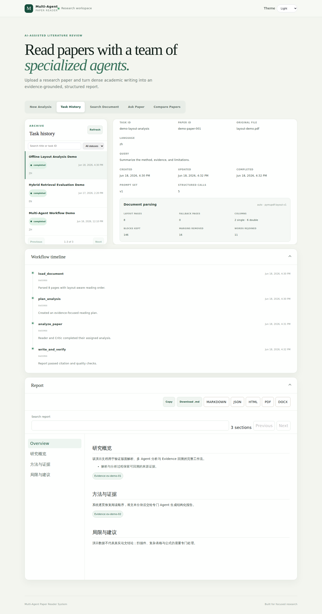
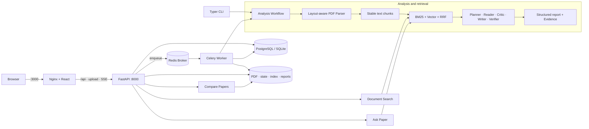
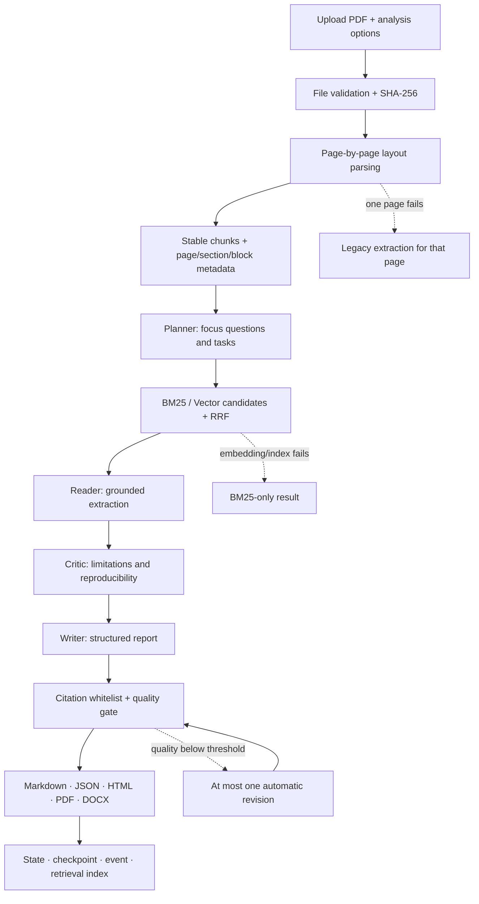

# Multi-Agent Paper Reader System

> 一个可离线演示的全栈科研论文阅读系统：从版面感知 PDF 解析、混合检索和多 Agent 分析，到可回溯 Evidence、论文问答与跨论文对比。




<p align="center"><em>演示数据界面预览：真实 React 界面，内容由确定性虚构任务生成，不包含真实论文、私人任务或 API Key。</em></p>

## 项目定位

Multi-Agent Paper Reader System 面向需要快速建立论文结构、核对证据和比较多篇研究的学习者、开发者与科研人员。用户可以上传文本型 PDF，让系统完成解析、分块、检索、多 Agent 阅读、质量检查和报告导出，并继续在同一任务上搜索原文或发起带引用的问答。

这是一个强调完整闭环、清晰模块边界和可重复演示的全栈工程项目，不是生产级学术平台，也不应替代研究者对原文、数据和结论的人工核验。默认 Mock 模式完全离线、无需 API Key，适合功能体验、开发和测试；接入 OpenAI-compatible 服务后可运行真实 LLM 与 Embedding，但效果、费用和数据处理边界取决于所选服务商。

适用场景包括：

- 快速理解单篇论文的研究问题、方法、实验、贡献与局限。
- 按章节或页码搜索论文原文，并查看相邻上下文和检索诊断。
- 围绕一篇已完成论文开展多轮问答，保留范围与 Evidence 引用。
- 对 2–5 篇已分析论文生成结构化矩阵和综合比较报告。
- 研究多 Agent、RAG、持久任务、SSE 恢复与文档处理的工程实现。

## 五个用户工作区

| 工作区 | 可以完成什么 |
| --- | --- |
| **New Analysis** | 上传 PDF，设置分析要求、输出语言、分析深度、目标读者、报告模板和自定义章节；查看后台进度、取消任务并阅读结果。 |
| **Task History** | 搜索和分页浏览持久任务；查看论文信息、解析诊断、Prompt/结构化调用摘要、工作流时间线、质量评分与报告。 |
| **Search Document** | 在已完成论文中按 Auto/BM25、章节、1-based 页码闭区间和 Top-K 搜索；查看命中来源、分数、相邻 chunk 与降级原因。 |
| **Ask Paper** | 创建持久会话，按全篇、章节或页码范围提问；支持中英文/自动语言、流式恢复、Evidence 抽屉、取消、重试、搜索、删除和 Markdown/JSON 归档。 |
| **Compare Papers** | 从历史中选择 2–5 篇完成任务，生成七维比较矩阵、共同点、差异、冲突、方法演进与适用场景，并导出完整产物。 |

## 核心能力

- **版面感知 PDF 解析**：基于 PyMuPDF block、字体与 bbox 恢复常见单栏/双栏阅读顺序，识别跨栏分隔，过滤重复页眉页脚，修复同一 block 内的拉丁文断词，并保留稳定 block/chunk 坐标元数据。
- **多 Agent 结构化报告**：Planner 制定阅读计划，Reader 提取内容，Critic 评估局限与可靠性，Writer 生成报告，Verifier 与确定性质量门检查完整性、忠实度和引用有效性。
- **可降级混合检索**：BM25 与向量召回分别保留候选，通过 RRF 融合；检索索引可持久化并缓存，Embedding 或索引失败时安全回退到 BM25。
- **Evidence 回溯**：报告、Ask Paper 和跨论文比较中的引用都绑定受控 Evidence ID，可查看来源任务、chunk、章节、页码和正文快照。
- **持久任务与恢复**：PostgreSQL/SQLite 保存任务、检查点和事件；Celery 执行分析、问答与比较；SSE 以递增事件 ID 支持刷新或断线续传。
- **任务生命周期**：严格校验 PDF 扩展名、MIME、文件头和大小；支持活动任务去重、阶段边界取消、失败重试、检查点恢复、重跑、删除和保留期清理。
- **论文问答与比较**：Ask Paper 控制历史消息和 Evidence token 预算；Compare Papers 保存来源论文快照，使完成后的比较不再依赖源任务文件。
- **五格式交付**：单篇报告和论文比较均可下载 Markdown、JSON、HTML、PDF、DOCX；Web 报告支持目录、搜索、复制和 Evidence 抽屉。
- **离线可重复运行**：Mock LLM 与 Mock Embedding 生成确定性结果，默认测试和演示不需要外部网络。

## 系统架构



Compose 模式下，Nginx 是浏览器入口，FastAPI 负责协议、校验和持久状态，Redis/Celery 承担异步执行，PostgreSQL 保存任务与事件，`runtime_data` 卷保存上传、状态、索引和报告产物。轻量测试与 CLI 可以使用 SQLite。

### 分析数据流



## 关键设计

### 逐页解析与局部降级

`PDF_LAYOUT_MODE=auto` 对每一页独立恢复 block 阅读顺序。某一页的版面分析异常时，只有该页回退到 legacy 文本提取，其他页面继续使用版面模式；空页不会伪装成可用文本，也不会自动执行 OCR。旧 state 可以继续加载，但不会自动重新处理。

### BM25、向量与 RRF

Auto 检索复用 `ask-retrieval-index-v1` 的磁盘索引和进程内缓存。BM25 与向量召回独立产生候选，RRF 按排名融合，向量相似度阈值不会删除 BM25 命中。Mock/未配置 Embedding、索引损坏、构建失败或查询失败时，响应明确标记 `degraded_to_bm25`，只暴露脱敏诊断，不返回密钥或内部异常详情。

### 引用白名单与质量门

Writer 只接收当前 Evidence 集合中的允许 ID。落盘前，单篇报告会去重并清除未知 Evidence 引用，比较报告也按比较命名空间清理引用；质量门进一步核对 Evidence 与论文 chunk、页码和章节的一致性。Evidence 能增强可追溯性，但不等同于人工事实核验。

### 检查点、SSE 与恢复

Worker 在分析阶段边界写入版本化检查点、进度和持久事件。任务、问答和比较的 SSE 都使用递增事件序号；客户端通过 `after` 或 `Last-Event-ID` 从最后位置继续，并以低频状态同步兜底。API 重启只将心跳超时的运行任务标为中断；兼容检查点存在时可显式恢复。

### 文件生命周期

任务元数据与事件保存在数据库，PDF、完整 state、检索索引和导出文件保存在输出目录。终态任务可手动永久删除，API 启动时也会按 `FILE_RETENTION_DAYS` 清理过期文件。活动源任务受比较流程保护；完成的比较保存必要来源快照，因此后续读取不依赖原任务文件。生产环境仍需要独立的对象存储、备份和恢复策略。

## 快速开始

### Docker Compose（推荐）

需要 Docker 与 Docker Compose。根目录 `.env.example` 是 Compose 配置入口，默认使用完全离线的 Mock 模式：

```bash
cp .env.example .env
docker compose up --build
```

等待 `postgres`、`redis`、`api`、`worker`、`frontend` 启动后访问：

- Web：<http://localhost:3000>
- FastAPI / Swagger：<http://localhost:8000/docs>
- 健康检查：<http://localhost:3000/api/health>

```bash
docker compose ps
curl http://localhost:3000/api/health
```

停止服务：

```bash
docker compose down
```

`docker compose down -v` 会同时删除 PostgreSQL、Redis 和运行产物卷，请只在确认不再需要本地数据时使用。

仓库还提供一个无版权的确定性双栏 PDF，用于观察跨栏顺序、页眉页脚过滤和断词修复：

```bash
uv run python -m backend.scripts.generate_layout_demo_pdf
```

### 宿主机开发

需要 Python 3.12+、[uv](https://docs.astral.sh/uv/)、Node.js 20+ 和 npm。

```bash
uv sync
cp backend/.env.example backend/.env

uv run uvicorn backend.api.main:app --reload
```

另开终端启动前端：

```bash
cd frontend
npm install
npm run dev
```

Vite 默认运行在 <http://localhost:5173> 并将 `/api` 代理到 <http://127.0.0.1:8000>。`backend/.env.example` 默认使用 SQLite 和内存 Broker，适合同步 API、CLI 与测试；要完整体验 Web 后台任务，请启动 PostgreSQL/Redis，并让 API 与 Worker 使用同一数据库和 Broker：

```bash
docker compose up -d postgres redis
uv run celery -A backend.worker.celery_app:celery_app worker --loglevel=INFO
```

此时需把 `backend/.env` 中的 `DATABASE_URL` 改为宿主机可访问的 PostgreSQL 地址；Redis 默认地址已经是 `localhost:6379`。Docker Compose 路径会自动完成这些连接设置。

### CLI

CLI 直接运行同步工作流，不需要 Celery：

```bash
uv run python -m backend.app.cli \
  --pdf backend/data/raw/layout_demo.pdf \
  --output backend/outputs/reports/layout-demo-report.md \
  --state-json backend/outputs/logs/layout-demo-state.json \
  --language zh \
  --verbose
```

### 接入真实 OpenAI-compatible 模型

在 `.env` 或 `backend/.env` 中分别配置 LLM 与 Embedding；二者可以来自不同服务商，也可以只替换其中一个：

```env
LLM_PROVIDER=openai_compatible
LLM_VENDOR=custom
LLM_MODEL=your-chat-model
LLM_API_KEY=your-api-key
LLM_BASE_URL=https://your-provider.example/v1

EMBEDDING_PROVIDER=openai_compatible
EMBEDDING_VENDOR=custom
EMBEDDING_MODEL=your-embedding-model
EMBEDDING_API_KEY=your-api-key
EMBEDDING_BASE_URL=https://your-provider.example/v1
```

不要提交真实密钥。真实调用依赖网络、配额和上游兼容性，可能产生费用，并可能把论文内容发送给外部服务商；请先确认数据政策。

## API 能力概览

完整请求字段和响应 Schema 以运行中的 [Swagger UI](http://localhost:8000/docs) 为准。主要入口如下：

| 分组 | 主要入口 | 用途 |
| --- | --- | --- |
| 健康与同步分析 | `GET /api/health`、`POST /api/analyze/upload` | 健康检查；等待完整流程结束的同步上传分析。 |
| 任务 | `POST /api/tasks/analyze`、`GET /api/tasks`、`GET /api/tasks/{task_id}` | 创建后台分析，查询历史、状态和安全详情。 |
| 生命周期与事件 | `POST .../cancel`、`.../retry`、`.../resume`、`.../rerun`、`GET .../events` | 控制任务并通过 SSE 恢复进度。 |
| 报告与证据 | `GET .../report/structured`、`.../evidence/{evidence_id}`、`.../artifacts/{format}` | 读取结构化报告、回溯 Evidence、下载五格式产物。 |
| 文档搜索 | `POST /api/tasks/{task_id}/search` | 在已完成论文内执行 Auto/BM25 检索和范围过滤。 |
| Ask Paper | `/api/tasks/{task_id}/conversations`、`/api/conversations/{id}/messages` | 管理会话、提问、取消/重试回答、续传事件和导出归档。 |
| 论文比较 | `/api/comparisons`、`/api/comparisons/{id}/events`、`.../artifacts/{format}` | 创建、查询、取消、重试和导出 2–5 篇论文比较。 |

更多后端运行与目录说明见 [backend/README.md](backend/README.md)。

## 项目结构

```text
.
├── backend/
│   ├── agents/             # Planner、Reader、Critic、Writer、Verifier
│   ├── api/                # FastAPI 路由、数据库 Store、SSE
│   ├── comparisons/        # 跨论文比较与导出
│   ├── core/               # 配置、编排、状态和质量门
│   ├── evaluation/         # Ask Paper 检索评估工具与说明
│   ├── exporters/          # Markdown / JSON / HTML / PDF / DOCX
│   ├── prompts/            # 可版本化 Markdown Prompt
│   ├── tools/              # PDF、分块、Embedding、检索与向量存储
│   ├── worker/             # Celery 任务
│   └── tests/              # 后端测试
├── frontend/
│   ├── src/                # React 工作区、组件、hooks 与 API client
│   └── e2e/                # Playwright 桌面与移动端用例
├── docs/                   # 专项设计文档与产品截图
├── docker-compose.yml      # 五服务本地栈
├── .env.example            # Compose 配置模板
└── pyproject.toml          # Python 依赖与项目元数据
```

## 配置入口

| 场景 | 配置文件 | 说明 |
| --- | --- | --- |
| Docker Compose | [`.env.example`](.env.example) → `.env` | PostgreSQL、Redis、任务恢复和检索默认值；Mock 模式离线运行。 |
| 宿主机后端 / CLI | [`backend/.env.example`](backend/.env.example) → `backend/.env` | 包含完整应用、路径、模型、请求策略、检索、上传和质量门示例。 |
| 前端开发 | `frontend/.env.local`（可选） | 通过 `VITE_API_BASE_URL` 覆盖 API 地址。 |

常用变量包括 `LLM_*`、`EMBEDDING_*`、`DATABASE_URL`、`CELERY_*`、`PDF_LAYOUT_MODE`、`ASK_*`、`MAX_UPLOAD_BYTES`、`FILE_RETENTION_DAYS`、`QUALITY_PASS_SCORE` 和 `CITATION_VALIDITY_MIN_SCORE`。所有路径相对仓库根目录解析。

## 测试与构建

```bash
# 后端全量回归（真实模型测试默认跳过）
uv run pytest backend/tests -q -rs
uv run ruff check backend

# 前端
cd frontend
npm test
npm run lint
npm run build
npm run test:e2e

# 仓库级检查（在根目录）
docker compose config --quiet
git diff --check
```

Mock 模式是默认测试路径。真实模型 smoke test 只有在显式设置 `RUN_REAL_LLM_TESTS=1` 且提供有效配置时才运行。

## 文档索引

- [后端开发指南](backend/README.md)
- [前端开发与浏览器行为](frontend/README.md)
- [文档检索增强设计](docs/document-retrieval-enhancement.md)
- [Ask Paper 检索评估](backend/evaluation/README.md)
- [系统设计初稿](Multi-Agent_Paper_Reader_System_Design_Doc_v0.1.md)
- [示例阅读报告](backend/outputs/reports/example_report.md)

## 当前限制

- 解析面向文本型、常见单栏/双栏 PDF；没有 OCR，也不重建复杂表格、公式语义或图片内容。
- Mock 模式用于流程演示，不代表真实语义质量；真实模型输出仍可能遗漏、误读或产生不可靠结论。
- Ask Paper 目前绑定单篇已完成任务；Compare Papers 提供结构化比较，但不是跨论文聊天。
- 默认持久化和文件存储适合本地演示，不包含生产级身份、租户隔离、备份、监控或弹性扩容。
- 私有检索评估基础设施已经存在，但当前结果不能替代正式人工 gold、冻结测试集和生产阈值校准。

## 后续优化

以下是唯一的未完成工作清单，按优先级归纳：

- 增加 OCR 与扫描件支持，改进复杂版面、三栏、表格单元格、公式和图片理解。
- 建立正式人工 gold，评估完整报告质量，并用真实 Embedding/Reranker 校准召回、阈值和拒答策略。
- 支持批量上传、arXiv/DOI/URL 导入、跨论文问答与文献综述辅助。
- 接入外部向量数据库，引入并行 Agent、可恢复任务图和长文性能优化。
- 改善无障碍与完整键盘操作，优化超长报告渲染，并扩充浏览器回归范围。
- 增加认证、权限、限流、Secret 管理、备份、Metrics、Tracing、告警和水平扩容。
- 增加正式 License、贡献指南、安全策略、行为准则和公开发布治理文件。

## 贡献

欢迎通过 Issue 讨论缺陷、设计和使用问题，也欢迎提交聚焦、可验证的 Pull Request。提交前请运行与改动相关的后端、前端、Compose 和 whitespace 检查，并避免提交论文原文、运行产物、私有评估数据或密钥。

仓库目前还没有正式 `CONTRIBUTING.md`；公开协作流程仍在“后续优化”中。

## License

本仓库目前**尚未声明开源许可证**。在作者选择并添加正式 License 之前，代码与文档不能被视为已获得通用的复制、修改或再分发授权。
