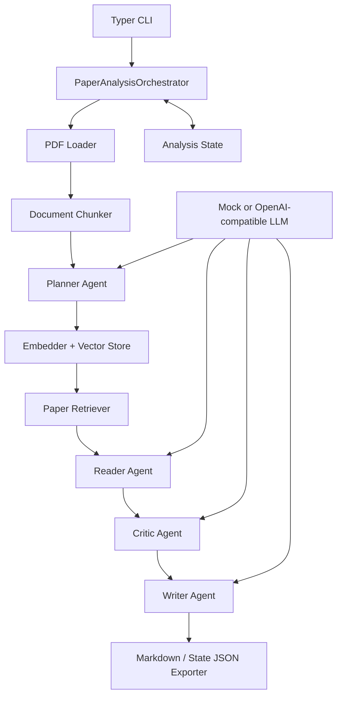

# Multi-Agent Paper Reader System

## 1. Project Overview

Multi-Agent Paper Reader System 是一个面向科研论文阅读的多智能体 MVP。系统接收本地 PDF，通过文档解析、文本分块和检索增强，为多个职责明确的 Agent 提供上下文，最终生成结构化的 Markdown 论文阅读报告。

项目采用 Planner + Specialized Agents 架构：Planner 规划阅读任务，Reader 提取论文内容，Critic 进行批判性分析，Writer 汇总生成报告。所有 Agent 通过统一的 LLM Client 调用模型，并使用 Pydantic Schema 约束输入和输出。

当前项目重点是展示一条清晰、可测试、可扩展的端到端 Agent 工作流，而不是提供生产级论文管理平台。

## 2. Key Features

- 解析本地文本型 PDF，并保留页码信息。
- 按可配置长度和重叠区间切分论文文本。
- 使用 embedding、内存向量库和相似度检索构建轻量 RAG 流程。
- 通过 Planner、Reader、Critic、Writer 四个 Agent 分工完成论文分析。
- 使用 Pydantic 校验 Agent 的结构化 JSON 输出。
- 支持完全离线、可重复的 mock 模式。
- 支持 OpenAI-compatible LLM 和 embedding API，例如阿里云百炼 Qwen。
- 通过 CLI 输出中文或英文 Markdown 报告，并可选保存完整运行状态 JSON。
- 提供单元测试、组件集成测试和显式启用的真实模型 smoke tests。

## 3. System Architecture



核心模块之间通过 Schema 传递数据：`PaperDocument` 保存解析后的论文，`AnalysisPlan` 定义任务计划，`EvidenceBundle` 保存检索证据，`ReaderNotes` 和 `CriticNotes` 保存中间分析，`FinalReport` 表示最终报告。

## 4. Workflow

1. `PDFLoader` 从本地 PDF 提取逐页文本和基础元数据。
2. `DocumentChunker` 生成带页码和稳定 ID 的文本分块。
3. `PlannerAgent` 根据论文元数据和用户问题生成分析任务与关注问题。
4. Embedder 将论文分块向量化，`NumpyVectorStore` 在内存中建立索引。
5. `PaperRetriever` 按 Planner 的关注问题检索相关证据。
6. `ReaderAgent` 基于证据忠实提取研究问题、贡献、方法和实验信息。
7. `CriticAgent` 分析优点、局限、缺失实验、可靠性和可复现性。
8. `WriterAgent` 汇总上述结果，生成中文或英文结构化报告。
9. `ReportExporter` 保存 Markdown，并可选保存完整 `AnalysisState` JSON。

当前 Orchestrator 按上述顺序串行执行，各步骤状态会记录在 `step_history` 中。

## 5. Tech Stack

- Python 3.12+
- Pydantic v2 / pydantic-settings：Schema 与环境配置
- PyMuPDF：PDF 文本提取
- NumPy：内存向量存储与余弦相似度检索
- OpenAI Python SDK：OpenAI-compatible 模型接口
- Typer / Rich：命令行入口与运行状态展示
- pytest：单元测试、集成测试和真实模型 smoke tests
- uv：依赖和虚拟环境管理

## 6. Project Structure

```text
backend/
├── agents/                 # BaseAgent、Planner、Reader、Critic、Writer
├── app/
│   ├── cli.py              # 当前可用的命令行入口
│   └── streamlit_app.py    # 预留的 Web UI 入口，尚未实现
├── core/
│   ├── config.py           # 环境变量与运行配置
│   ├── orchestrator.py     # 端到端工作流编排
│   └── state.py            # 工作流状态与步骤记录
├── exporters/              # Markdown 和 JSON 导出
├── llm/                    # Mock 与 OpenAI-compatible LLM Client
├── schemas/                # 论文、Agent I/O、报告数据模型
├── tools/                  # PDF、分块、embedding、检索、向量存储
├── tests/                  # 单元、集成和真实 API 测试
├── data/raw/               # 示例与本地输入 PDF
├── outputs/reports/        # 生成的阅读报告
├── .env.example            # 安全的环境变量模板
└── README.md
```

## 7. Installation

以下命令均在仓库根目录执行。

```bash
git clone <your-repository-url>
cd Multi-Agent_Paper_Reader_System_Design
uv sync
cp backend/.env.example backend/.env
```

验证 CLI 是否安装成功：

```bash
uv run python -m backend.app.cli --help
```

默认配置使用 mock LLM 和 mock embedding，不需要 API Key，也不会访问外部模型服务。

## 8. Environment Configuration

应用从 `backend/.env` 读取配置。请复制 `.env.example` 后修改，切勿提交包含真实密钥的 `.env`。

### Offline mock mode

```env
LLM_PROVIDER=mock
LLM_VENDOR=mock
LLM_MODEL=mock-llm

EMBEDDING_PROVIDER=mock
EMBEDDING_VENDOR=mock
EMBEDDING_MODEL=mock-embedding
```

该模式适合本地演示、开发和测试。它会执行完整工作流，但 Agent 输出和 embedding 是确定性的模拟结果，不代表真实语义分析质量。

### Qwen through DashScope

```env
LLM_PROVIDER=openai_compatible
LLM_VENDOR=qwen
LLM_MODEL=qwen-max
LLM_API_KEY=your_dashscope_api_key
LLM_BASE_URL=https://dashscope.aliyuncs.com/compatible-mode/v1

EMBEDDING_PROVIDER=openai_compatible
EMBEDDING_VENDOR=qwen
EMBEDDING_MODEL=text-embedding-v4
EMBEDDING_API_KEY=your_dashscope_api_key
EMBEDDING_BASE_URL=https://dashscope.aliyuncs.com/compatible-mode/v1
```

LLM 与 embedding 可以独立配置。例如使用 DeepSeek LLM 时，可以继续使用 mock embedding，或者配置另一个兼容 embedding 服务。

主要运行参数：

| Variable | Default | Description |
| --- | --- | --- |
| `DEFAULT_TOP_K` | `5` | 默认检索结果数量 |
| `CHUNK_SIZE` | `1200` | 单个文本分块的目标字符数 |
| `CHUNK_OVERLAP` | `150` | 相邻分块的重叠字符数 |
| `RUN_REAL_LLM_TESTS` | `0` | 是否执行真实 API 测试；仅值为 `1` 时启用 |

## 9. Usage

### Offline demo

确认 `backend/.env` 使用 mock 配置，然后运行：

```bash
uv run python -m backend.app.cli \
  --pdf backend/data/raw/example.pdf \
  --output backend/outputs/reports/report.md \
  --language zh \
  --verbose
```

生成英文报告并保存完整状态：

```bash
uv run python -m backend.app.cli \
  --pdf backend/data/raw/example.pdf \
  --output backend/outputs/reports/report_en.md \
  --state-json backend/outputs/reports/state.json \
  --language en
```

CLI 参数：

- `--pdf, -p`：输入 PDF 路径，必填。
- `--output, -o`：Markdown 报告输出路径。
- `--query, -q`：自定义论文分析要求。
- `--language, -l`：`zh` 或 `en`。
- `--verbose, -v`：打印各工作流步骤。
- `--state-json`：可选的完整状态 JSON 输出路径。

真实模型模式使用相同命令，只需先在 `backend/.env` 中配置有效 API。真实调用依赖网络、服务配额和模型可用性，并可能产生费用。

## 10. Testing

运行默认测试套件：

```bash
uv run pytest backend/tests -q -rs
```

普通测试使用 mock 客户端，不需要网络。真实测试默认被跳过。

单独运行组件测试：

```bash
uv run pytest backend/tests/test_retriever.py -v
uv run pytest backend/tests/test_orchestrator.py -v
uv run pytest backend/tests/test_cli.py -v
```

配置好真实 LLM 后，可以显式执行真实 smoke tests：

```bash
RUN_REAL_LLM_TESTS=1 uv run pytest backend/tests/test_planner_agent_real.py -v -s
RUN_REAL_LLM_TESTS=1 uv run pytest backend/tests/test_orchestrator_real.py -v -s
```

真实 Orchestrator 测试还会使用当前 embedding 配置。执行前请确认 API Key、Base URL、模型、网络和账户配额均有效。

## 11. Example Output

仓库提供了一份[示例论文阅读报告](outputs/reports/example_report.md)。最终报告通常包含：

- 基本信息与 TL;DR
- 研究问题与背景
- 主要贡献
- 方法总结
- 实验与结果
- 优点与局限
- 缺失实验与潜在风险
- 可复现性说明
- 创新性、可靠性与综合评价
- 与正文分块对应的 evidence IDs

实际内容取决于 PDF 文本质量、检索结果、用户 query 和所选模型。mock 模式只用于展示数据流和输出结构。

## 12. Development Roadmap

- 支持 arXiv ID、论文 URL 和远程 PDF 输入。
- 增加扫描版 PDF 的 OCR 与更可靠的标题、作者、摘要提取。
- 增加章节识别、表格和图片理解。
- 使用 FAISS、Qdrant、Milvus 等持久化或可扩展向量存储。
- 增加证据去重、引用校验和检索质量评估。
- 将独立任务并行化，并支持可恢复的任务图执行。
- 提供 FastAPI 服务、Streamlit/Web UI 和异步任务状态查询。
- 增加模型重试、超时、限流、缓存、成本统计和可观测性。
- 支持更多模型厂商、本地模型和 vendor-specific structured output。
- 增加批量论文、跨论文比较和文献综述能力。

## 13. Notes and Limitations

- 当前端到端入口只支持本地文本型 PDF；`arxiv` 和 `url` 仅在 Schema 中预留。
- 未集成 OCR，扫描版或复杂排版 PDF 的文本提取质量可能较差。
- 标题、作者、摘要和章节元数据提取仍较基础，可能显示为 Unknown。
- Orchestrator 当前串行执行，尚未实现真正的并行多 Agent 调度。
- `NumpyVectorStore` 仅保存在进程内，退出后索引不会持久化。
- mock embedding 不具备语义检索能力，mock Agent 输出也不是论文真实分析。
- 真实模型必须返回符合 Schema 的 JSON；模型输出偏差可能导致校验失败。
- 长论文和大量检索证据可能受到模型上下文窗口限制。
- 真实 API 调用可能遇到网络超时、鉴权失败、限流、模型不可用和调用费用。
- 当前项目没有用户认证、权限控制、任务队列和生产部署保障。
