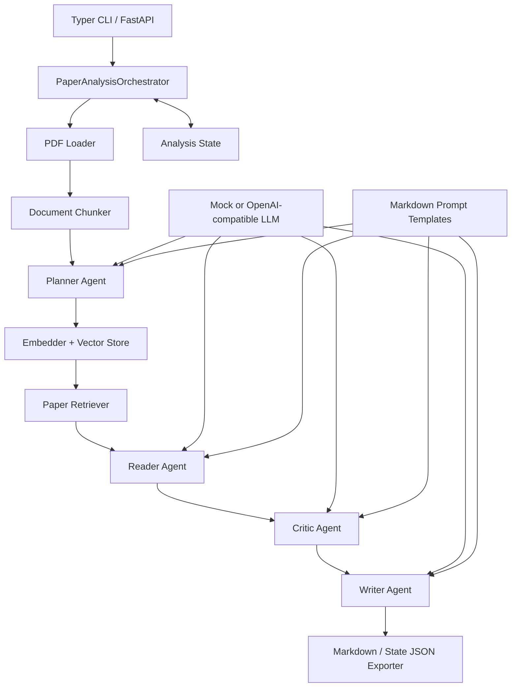

# Multi-Agent Paper Reader System

## 1. Project Overview

Multi-Agent Paper Reader System 是一个面向科研论文阅读的多智能体 MVP。系统接收本地 PDF，通过文档解析、文本分块和检索增强，为多个职责明确的 Agent 提供上下文，最终生成结构化的 Markdown 论文阅读报告。

项目采用 Planner + Specialized Agents 架构：Planner 规划阅读任务，Reader 提取论文内容，Critic 进行批判性分析，Writer 汇总生成报告。所有 Agent 通过统一的 LLM Client 调用模型，并使用 Pydantic Schema 约束输入和输出。

当前项目重点是展示一条清晰、可测试、可扩展的端到端 Agent 工作流，而不是提供生产级论文管理平台。

## 2. Key Features

- 解析本地文本型 PDF，并保留页码信息。
- 按可配置长度和重叠区间切分论文文本。
- 使用 embedding、内存向量库和相似度检索构建轻量 RAG 流程。
- 通过 Planner、Reader、Critic、Writer 四个 Agent 分工完成论文分析。
- 使用 Pydantic 校验 Agent 的结构化 JSON 输出。
- 从 `prompts/` 中加载可独立迭代的 Markdown Prompt 模板。
- 宽容提取被代码块或解释文字包裹、含尾随逗号的 JSON，并在 Schema 校验失败时把错误反馈给模型自动重试。
- 支持完全离线、可重复的 mock 模式。
- 支持 OpenAI-compatible LLM 和 embedding API，例如阿里云百炼 Qwen。
- 通过 CLI 输出中文或英文 Markdown 报告，并可选保存完整运行状态 JSON。
- 提供 FastAPI 同步上传分析、Celery 后台任务 API，以及健康检查、任务状态、报告查询和 Swagger/ReDoc 文档。
- 为已完成任务提供持久化 Ask Paper 会话、页码/章节范围、预算化上下文、会话搜索/删除、Markdown/JSON 引用归档、流式回答恢复、Evidence、取消和失败重试。
- 为 LLM 与 embedding 提供统一超时、指数退避和有限总预算；仅重试连接错误、超时、429 与 5xx。
- 严格校验 PDF 上传并支持活动任务去重、协作式取消、失败/取消后重试和文件保留期清理。
- 记录 Prompt Set、模板哈希及结构化输出成功/重试/失败统计，不保存模型原始响应。
- 提供单元测试、组件集成测试和显式启用的真实模型 smoke tests。

## 3. System Architecture



核心模块之间通过 Schema 传递数据：`PaperDocument` 保存解析后的论文，`AnalysisPlan` 定义任务计划，`EvidenceBundle` 保存检索证据，`ReaderNotes` 和 `CriticNotes` 保存中间分析，`FinalReport` 表示最终报告。

## 4. Workflow

1. `PDFLoader` 从本地 PDF 提取逐页文本和基础元数据。
2. `DocumentChunker` 生成带页码和稳定 ID 的文本分块。
3. `PlannerAgent` 根据论文元数据和用户问题生成分析任务与关注问题。
4. Embedder 将论文分块向量化，`NumpyVectorStore` 在内存中建立索引。
5. `PaperRetriever` 按 Planner 的关注问题检索相关证据。
6. `ReaderAgent` 基于证据忠实提取研究问题、贡献、方法和实验信息。
7. `CriticAgent` 分析优点、局限、缺失实验、可靠性和可复现性。
8. `WriterAgent` 汇总上述结果，生成中文或英文结构化报告。
9. `ReportExporter` 保存 Markdown，并可选保存完整 `AnalysisState` JSON；API 可同步返回结果，或在后台任务中更新 SQLite 任务状态供轮询。

当前 Orchestrator 按上述顺序串行执行，各步骤状态会记录在 `step_history` 中。

## 5. Tech Stack

- Python 3.12+
- Pydantic v2 / pydantic-settings：Schema 与环境配置
- PyMuPDF：PDF 文本提取
- NumPy：内存向量存储与余弦相似度检索
- OpenAI Python SDK：OpenAI-compatible 模型接口
- FastAPI / Uvicorn：HTTP API 与开发服务器
- Typer / Rich：命令行入口与运行状态展示
- pytest：单元测试、集成测试和真实模型 smoke tests
- uv：依赖和虚拟环境管理

## 6. Project Structure

```text
backend/
├── agents/                 # BaseAgent、Planner、Reader、Critic、Writer
├── api/                    # FastAPI 应用、同步分析与后台任务路由
├── app/
│   ├── cli.py              # 当前可用的命令行入口
│   └── streamlit_app.py    # 预留的 Web UI 入口，尚未实现
├── core/
│   ├── config.py           # 环境变量与运行配置
│   ├── orchestrator.py     # 端到端工作流编排
│   └── state.py            # 工作流状态与步骤记录
├── exporters/              # Markdown 和 JSON 导出
├── llm/                    # Mock 与 OpenAI-compatible LLM Client
├── prompts/                # 可外置迭代的 Markdown Prompt 模板
├── schemas/                # 论文、Agent I/O、报告数据模型
├── tools/                  # PDF、分块、embedding、检索、向量存储
├── tests/                  # 单元、集成和真实 API 测试
├── data/raw/               # 示例与本地输入 PDF
├── outputs/reports/        # 生成的阅读报告
├── outputs/uploads/        # API 上传文件（运行时生成）
├── outputs/logs/           # API/CLI 状态 JSON（运行时生成）
├── .env.example            # 安全的环境变量模板
└── README.md
```

## 7. Installation

以下命令均在仓库根目录执行。

```bash
git clone <your-repository-url>
cd Multi-Agent_Paper_Reader_System_Design
uv sync
cp backend/.env.example backend/.env
```

验证 CLI 是否安装成功：

```bash
uv run python -m backend.app.cli --help
```

默认配置使用 mock LLM 和 mock embedding，不需要 API Key，也不会访问外部模型服务。

## 8. Environment Configuration

应用从 `backend/.env` 读取配置。请复制 `.env.example` 后修改，切勿提交包含真实密钥的 `.env`。该文件曾被 Git 跟踪；停止跟踪不会清除既有历史，因此任何曾写入其中的真实 API key 都必须在对应服务商侧轮换。

### Offline mock mode

```env
LLM_PROVIDER=mock
LLM_VENDOR=mock
LLM_MODEL=mock-llm

EMBEDDING_PROVIDER=mock
EMBEDDING_VENDOR=mock
EMBEDDING_MODEL=mock-embedding
```

该模式适合本地演示、开发和测试。它会执行完整工作流，但 Agent 输出和 embedding 是确定性的模拟结果，不代表真实语义分析质量。

### Qwen through DashScope

```env
LLM_PROVIDER=openai_compatible
LLM_VENDOR=qwen
LLM_MODEL=qwen-max
LLM_API_KEY=your_dashscope_api_key
LLM_BASE_URL=https://dashscope.aliyuncs.com/compatible-mode/v1

EMBEDDING_PROVIDER=openai_compatible
EMBEDDING_VENDOR=qwen
EMBEDDING_MODEL=text-embedding-v4
EMBEDDING_API_KEY=your_dashscope_api_key
EMBEDDING_BASE_URL=https://dashscope.aliyuncs.com/compatible-mode/v1
```

LLM 与 embedding 可以独立配置。例如使用 DeepSeek LLM 时，可以继续使用 mock embedding，或者配置另一个兼容 embedding 服务。

主要运行参数：

| Variable | Default | Description |
| --- | --- | --- |
| `DEFAULT_TOP_K` | `5` | 默认检索结果数量 |
| `CHUNK_SIZE` | `1200` | 单个文本分块的目标字符数 |
| `CHUNK_OVERLAP` | `150` | 相邻分块的重叠字符数 |
| `DATABASE_URL` | `sqlite:///backend/data/tasks.db` | 任务历史 SQLite 数据库 |
| `REQUEST_CONNECT_TIMEOUT` / `REQUEST_READ_TIMEOUT` | `10` / `60` | 外部请求连接与读取超时（秒） |
| `REQUEST_TOTAL_BUDGET` | `120` | 单次任务请求重试总预算（秒） |
| `REQUEST_MAX_RETRIES` | `2` | 可重试请求的最大重试次数 |
| `REQUEST_BACKOFF_BASE` / `REQUEST_BACKOFF_MAX` | `1` / `8` | 指数退避基数与上限（秒） |
| `MAX_UPLOAD_BYTES` | `52428800` | 上传上限，默认 50 MiB |
| `FILE_RETENTION_DAYS` | `30` | 终态任务产物保留天数 |
| `PROMPT_SET_VERSION` | `v1` | Prompt 集版本标识 |
| `RUN_REAL_LLM_TESTS` | `0` | 是否执行真实 API 测试；仅值为 `1` 时启用 |

## 9. Usage

### Ask Paper offline evaluation

固定合成数据集位于 `backend/evaluation/fixtures/ask_paper_v1.json`。它覆盖中英文查询、章节约束、多正确分块、无答案拒答和引用白名单，默认完全离线运行：

```bash
uv run python -m backend.evaluation.ask_paper --mode all --gate \
  --output backend/outputs/logs/ask-paper-eval.json
```

JSON 报告分别保留 BM25、原始 hybrid、filtered-hybrid 和 embedding degraded 运行。当前 filtered-hybrid 在固定夹具上的 Recall@6 为 100%，噪声率为 53.57%；该噪声水平仍然偏高，且夹具阈值 `1.0` 与生产默认值 `0.0` 不一致，所以结果仅用于验证过滤方向和防止回归，不代表生产质量达标。

真实私有评估的基础设施已完成：仓库提供脱敏 Schema/fixture，以及候选生成、production profile 校验、validation 阈值校准、test 内容冻结和单次冻结质量门。`pilot-v1` 的 122 条样本仅用于工程链路验证，其中 validation 为 20 条；本轮未运行 frozen-test，validation 有 8 项硬门槛失败，所以当前最稳妥基线仍是 BM25，reranker 保持 `disabled`。完整的数据字段、限制、CLI 和指标口径见 [`evaluation/README.md`](evaluation/README.md)。

### Offline demo

确认 `backend/.env` 使用 mock 配置，然后运行：

```bash
uv run python -m backend.app.cli \
  --pdf backend/data/raw/example.pdf \
  --output backend/outputs/reports/report.md \
  --language zh \
  --verbose
```

生成英文报告并保存完整状态：

```bash
uv run python -m backend.app.cli \
  --pdf backend/data/raw/example.pdf \
  --output backend/outputs/reports/report_en.md \
  --state-json backend/outputs/reports/state.json \
  --language en
```

CLI 参数：

- `--pdf, -p`：输入 PDF 路径，必填。
- `--output, -o`：Markdown 报告输出路径。
- `--query, -q`：自定义论文分析要求。
- `--language, -l`：`zh` 或 `en`。
- `--verbose, -v`：打印各工作流步骤。
- `--state-json`：可选的完整状态 JSON 输出路径。

真实模型模式使用相同命令，只需先在 `backend/.env` 中配置有效 API。真实调用依赖网络、服务配额和模型可用性，并可能产生费用。

### FastAPI

启动开发服务器：

```bash
uv run uvicorn backend.api.main:app --reload
```

健康检查与交互式文档分别位于 `GET /api/health`、<http://127.0.0.1:8000/docs> 和 <http://127.0.0.1:8000/redoc>。同步上传会等待完整分析完成：

```bash
curl -X POST http://127.0.0.1:8000/api/analyze/upload \
  -F 'file=@backend/data/raw/example.pdf;type=application/pdf' \
  -F 'query=分析这篇论文' -F 'language=zh'
```

后台任务接口会立即返回 `task_id`，随后可轮询状态并读取完成后的报告：

```bash
curl -X POST http://127.0.0.1:8000/api/tasks/analyze \
  -F 'file=@backend/data/raw/example.pdf;type=application/pdf' \
  -F 'language=zh'
curl http://127.0.0.1:8000/api/tasks/{task_id}
curl http://127.0.0.1:8000/api/tasks/{task_id}/report
curl -X POST http://127.0.0.1:8000/api/tasks/{task_id}/cancel
curl -X POST http://127.0.0.1:8000/api/tasks/{task_id}/retry
```

任务历史和安全详情接口：

```bash
curl 'http://127.0.0.1:8000/api/tasks?limit=20&offset=0'
curl http://127.0.0.1:8000/api/tasks/{task_id}/detail
```

详情可返回论文标题、作者、工作流步骤摘要和可用的 Markdown 报告；不会返回论文全文分块、Agent 原始中间内容、模型原始响应或 API Key。

### Ask Paper API

Ask Paper 仅接受已完成且 state 产物可用的单篇论文任务。会话、消息、Evidence 和流事件保存在任务数据库中，生成由 Celery Worker 执行，因此浏览器断开不会取消回答。

```text
POST  /api/tasks/{task_id}/conversations
GET   /api/tasks/{task_id}/conversations?search={literal_substring}
GET   /api/conversations/{conversation_id}
PATCH /api/conversations/{conversation_id}
DELETE /api/conversations/{conversation_id}
GET   /api/conversations/{conversation_id}/artifacts/{markdown|json}
POST  /api/conversations/{conversation_id}/messages
GET   /api/conversations/{conversation_id}/messages/{message_id}/events?after={sequence}
POST  /api/conversations/{conversation_id}/messages/{message_id}/cancel
POST  /api/conversations/{conversation_id}/messages/{message_id}/retry
```

`search` 对会话标题、用户消息和助手消息执行大小写不敏感的字面子串匹配，空白值等同完整列表，结果仍按 `updated_at` 倒序。删除会话返回 `204`，并在一个事务中清理消息、Evidence 和流事件；导出附件使用版本化 JSON Schema `ask-paper-conversation-v1` 或可读 Markdown，且只包含助手 `citation_ids` 实际引用的 Evidence。生成中的会话删除或导出返回 `409`。

创建消息的 JSON 可选携带 `page_start` 与 `page_end`。两者必须同时提供，使用从 1 开始的闭区间且 `page_start <= page_end`；超出论文总页数返回 `422`。页码范围与 `section` 同时存在时取交集，跨越范围边界的 chunk 只要与闭区间重叠即可参与检索。范围持久化到用户和助手消息，失败重试沿用原范围，Markdown/JSON 会话归档也会保留它。

SSE 事件包括 `token`、`completed`、`failed`、`canceled` 和 `heartbeat`。客户端可使用 `after` 或 `Last-Event-ID` 恢复；事件序号和最终消息正文都来自持久化存储。问答 Evidence ID 使用消息命名空间，并可通过现有 `GET /api/tasks/{task_id}/evidence/{evidence_id}` 查询。

每次问答先在消息数与估算 token 双重预算内选取连续的最近终态历史，将追问改写为独立检索问题，再对所选章节和页码交集执行 BM25 与向量双路候选召回，并用 RRF 融合。Evidence 按排序从高到低装入独立 token 预算，只有最后一个片段可能被截断，持久化快照与实际提供给模型的正文保持一致。Mock Embedding 时只使用 BM25；真实 Embedding 建索引或查询失败时也会自动降级为 BM25。改写失败则确定性拼接预算窗口内最近用户问题与当前问题。默认配置如下，可通过同名环境变量覆盖：

```dotenv
ASK_CANDIDATE_COUNT=20
ASK_EVIDENCE_COUNT=6
ASK_RRF_K=60
ASK_VECTOR_MIN_SIMILARITY=0.0
ASK_RERANKER_MODE=disabled
ASK_RERANKER_PROVIDER=openai_compatible
ASK_RERANKER_MODEL=
ASK_RERANKER_API_KEY=
ASK_RERANKER_BASE_URL=
ASK_RERANKER_TIMEOUT=1.0
ASK_EVIDENCE_THRESHOLD=0.0
ASK_ANSWERABILITY_THRESHOLD=0.0
ASK_CALIBRATION_VERSION=uncalibrated
ASK_REWRITE_MAX_TOKENS=160
ASK_HISTORY_MAX_MESSAGES=12
ASK_HISTORY_MAX_TOKENS=2000
ASK_EVIDENCE_MAX_TOKENS=6000
ASK_RETRIEVAL_CACHE_SIZE=8
```

Worker 内索引缓存键包含任务、state 文件版本、章节、页码范围及 Embedding provider/model，重启后从 state 重建。所有进入模型上下文的检索 Evidence 均保存为消息快照，但 `citation_ids` 只记录答案实际使用且属于本次白名单的 ID；非法和跨消息引用会从最终答案清除。无候选证据时不会调用回答生成模型。诊断日志记录范围、预算用量、分支状态、降级类型、候选数和融合分数，不记录论文正文、完整问题或密钥。

`ASK_VECTOR_MIN_SIMILARITY` 在向量候选进入 RRF 前生效；无论该值如何配置，零分、负分和非有限分数都会被移除。默认 `0.0` 只排除明确无效结果，不保证足以控制正分噪声。生产阈值应按实际 embedding 模型的分数分布校准。

Reranker 支持 `disabled`、`shadow` 和 `enabled`。`shadow` 会调用模型并记录排序、top score 与延迟，但仍返回 hybrid 顺序；`enabled` 才应用重排、Evidence 阈值和独立 answerability 阈值。超时、限流、网络异常或无效响应均自动降级到 hybrid，诊断只记录异常类型。当前 adapter 使用 OpenAI/Cohere 风格的 `POST /reranks` 协议；阿里云 `qwen3-rerank` 的 base URL 应配置到业务空间的 `.../compatible-api/v1`，代码会追加 `/reranks`。API key 与 LLM/Embedding 可以相同，但需要通过 `ASK_RERANKER_API_KEY` 显式配置。

候选诊断保留 BM25/向量原始分数、排名、命中来源、hybrid 分数与 reranker 分数。向量阈值只移除向量贡献，不会删除同一 chunk 的 BM25 命中。默认日志不记录论文原文、完整问题或上游错误详情。

固定检索夹具的回归门槛为 Recall@6 ≥ 90%、章节跨界返回率 0%、非法引用保留率 0%、无答案拒答率 100%，并比较 filtered-hybrid 与 BM25、原始 hybrid 的相对噪声率。这些门槛不是生产验收标准；当前仍需降低 53.57% 的绝对噪声率并用真实 embedding 验证。

Ask Paper 基础表由 `0002_ask_paper.py` 创建，页码范围列由 `0003_ask_page_scope.py` 升级；SQLite 轻量运行会在启动时补齐相同列。任务删除时会同步清理其全部问答数据。

后台上传接口只接受 `.pdf`、`application/pdf` 或 `application/octet-stream`，并校验 `%PDF-` 文件头和大小。相同 SHA-256、标准化 query 与 language 的活动任务会复用原 `task_id`。取消在工作流阶段边界生效；重试仅适用于 `failed/canceled`，并创建通过 `retry_of` 关联的新任务。

PDF metadata、首页布局和文本规则抽取统一保存为带来源与置信度的强类型字段。内嵌标题/作者与布局候选同时存在时按置信度合并，避免元数据类型不一致导致解析失败。

每个 HTTP 响应都包含 `X-Request-ID`。错误响应包含兼容的 `detail` 以及 `code`、`request_id`。任务详情的 workflow metadata 会提供 Prompt 版本、模板哈希和结构化输出统计。

上传文件写入 `OUTPUT_DIR/uploads`，报告和状态分别写入 `REPORT_DIR`、`LOG_DIR`；相对路径以 `PROJECT_ROOT` 为基准。

## 10. Testing

运行默认测试套件：

```bash
uv run pytest backend/tests -q -rs
```

普通测试使用 mock 客户端，不需要网络。真实测试默认被跳过。

Ask Paper API 使用每个测试独立的临时 SQLite 与 state 文件，并以确定性 fake 替换 Worker 调度。专项覆盖任务/会话隔离、页码范围校验与持久化、章节/页码交集、上下文预算、字面搜索、级联删除与任务删除复用、Markdown/JSON 归档、Evidence 任务归属、取消/重试，以及 SSE `after`、`Last-Event-ID`、token 顺序和终态关闭：

```bash
uv run pytest backend/tests/test_api_ask_paper.py -q -rs
```

当前依赖组合中的 Starlette `TestClient` 在线程 portal 内执行同步端点时可能停滞，因此 Ask Paper HTTP 入口使用 async 路由，测试夹具通过 ASGI transport 发起请求；REST 与 SSE 协议保持不变。

单独运行组件测试：

```bash
uv run pytest backend/tests/test_retriever.py -v
uv run pytest backend/tests/test_orchestrator.py -v
uv run pytest backend/tests/test_cli.py -v
```

配置好真实 LLM 后，可以显式执行真实 smoke tests：

```bash
RUN_REAL_LLM_TESTS=1 uv run pytest backend/tests/test_planner_agent_real.py -v -s
RUN_REAL_LLM_TESTS=1 uv run pytest backend/tests/test_orchestrator_real.py -v -s
```

真实 Orchestrator 测试还会使用当前 embedding 配置。执行前请确认 API Key、Base URL、模型、网络和账户配额均有效。

## 11. Example Output

仓库可提供一份[示例论文阅读报告](outputs/reports/example_report.md)。示例 PDF 与报告仅应在确认版权、隐私和再分发许可后加入公开仓库。最终报告通常包含：

- 基本信息与 TL;DR
- 研究问题与背景
- 主要贡献
- 方法总结
- 实验与结果
- 优点与局限
- 缺失实验与潜在风险
- 可复现性说明
- 创新性、可靠性与综合评价
- 与正文分块对应的 evidence IDs

实际内容取决于 PDF 文本质量、检索结果、用户 query 和所选模型。mock 模式只用于展示数据流和输出结构。

## 12. Development Roadmap

已完成的基础能力包括 React Web UI、PostgreSQL/SQLite 持久化、Redis + Celery 任务队列、可恢复 SSE、结构化报告与 Evidence，以及单篇论文 Ask Paper。后续工作按优先级为：

1. **检索与问答质量**：会话管理、页码/章节范围和预算化上下文已完成；继续扩展人工标注并解决 pilot validation 的 8 项失败，在冻结测试通过前维持 BM25 与 reranker `disabled`。
2. **文档理解**：OCR、复杂多栏版面、表格、公式、图片与图注，并保留可引用的位置关系。
3. **多论文研究**：批量/arXiv/DOI/URL 输入、跨论文证据检索、对比矩阵、研究脉络与文献综述。
4. **可靠执行与运维**：可恢复任务图、Worker 水平扩容、Metrics/Tracing、Secret 管理、数据库备份和生产迁移流程。
5. **产品安全**：认证、租户隔离、上传与调用限流、用户配额、审计、安全响应头和数据保留策略。
6. **模型生态**：更多厂商、本地模型和 vendor-specific structured output，并建立 token、延迟和成本看板。

## 13. Notes and Limitations

- 当前端到端入口只支持本地文本型 PDF；`arxiv` 和 `url` 仅在 Schema 中预留。
- 未集成 OCR，扫描版或复杂排版 PDF 的文本提取质量可能较差。
- 标题、作者、摘要、DOI、arXiv、年份、关键词和章节使用 PDF metadata、首页版面与文本规则组合抽取，并记录来源和置信度；扫描件仍需 OCR。
- 创建分析支持 `analysis_depth`、`target_audience`、`report_template` 与受限的 `custom_sections`。报告完成后可通过 `/api/tasks/{task_id}/artifacts/{format}` 按需导出 Markdown、JSON、HTML、PDF 或 DOCX。
- Writer 后始终执行引用可追溯性与证据覆盖检查；未通过时清理无效引用并复核一次，仍不通过则交付带质量警告的报告。
- `LLM_PROVIDER=openai_compatible` 时，标题、作者和 venue 默认由结构化 Metadata Extractor 对首页版面候选进行裁决，其他缺失或低置信字段由其补充。输入严格限制为首页文本块及字号/坐标/旋转方向、摘要候选和章节标题；模型结果必须通过离线候选一致性检查。真实 Verifier 检查报告与证据并产生五维评分、问题和修订指令，Writer 最多修订一次。state 只保存质量摘要，不保存 Verifier 原始响应。
- 元数据裁决不是自由生成：标题、作者和 venue 至少 90% 的词必须回溯到首页候选；旋转 arXiv 标记、日期、机构、邮箱、摘要/章节标题及与标题高度重合的作者结果会被拒绝。模型失败时保留离线结果。
- Orchestrator 当前串行执行，尚未实现真正的并行多 Agent 调度。
- `NumpyVectorStore` 仅保存在进程内，退出后索引不会持久化。
- mock embedding 不具备语义检索能力，mock Agent 输出也不是论文真实分析。
- Prompt 模板可独立修改，但其中的模板变量必须与对应 Agent 的渲染参数匹配。
- JSON 解析器可处理代码块、周边解释文字和尾随逗号；Schema 失败会把校验错误反馈给模型重试。网络错误由独立的共享请求策略处理。
- 长论文和大量检索证据可能受到模型上下文窗口限制。
- 真实 API 调用可能遇到网络超时、鉴权失败、限流、模型不可用和调用费用。
- Compose 后台任务由独立 Celery Worker 执行，任务元数据持久化到 PostgreSQL；兼容检查点的失败任务可恢复。SQLite 仍用于测试和轻量本地开发。
- 状态 JSON 和 Markdown 报告仍是独立文件。文件被移动或删除后历史元数据仍可查询，但详情中的步骤或报告内容不可用；系统不会自动导入旧运行产物。
- 默认上传上限为 50 MiB；终态任务文件默认保留 30 天并在启动时清理，任务元数据仍会保留。
- 取消在阶段边界生效，不会强制终止正在进行的单次模型请求。系统仍没有认证、权限控制、限流和生产部署保障。
# Durable API and worker

Compose starts PostgreSQL, Redis, the API, Celery worker, and Nginx frontend. The API runs `alembic upgrade head` before Uvicorn; the worker uses the same image and shared output volume. The application is available at <http://localhost:3000>, while FastAPI remains directly available at <http://localhost:8000>. Useful commands:

```bash
docker compose logs -f worker
docker compose exec api alembic upgrade head
curl http://localhost:3000/api/health
```

Task operations include `/cancel`, `/retry`, `/resume`, `/rerun`, `DELETE /api/tasks/{id}`, durable SSE `/events`, structured `/report/structured`, and task-scoped `/evidence/{evidence_id}`. SQLite import is always explicit and idempotently skips existing task IDs.
